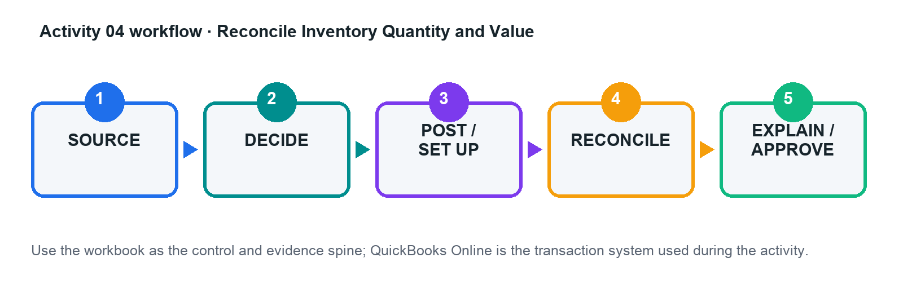
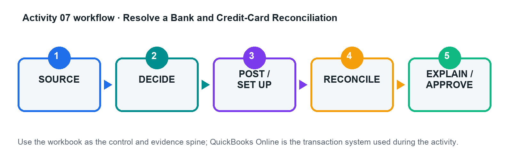
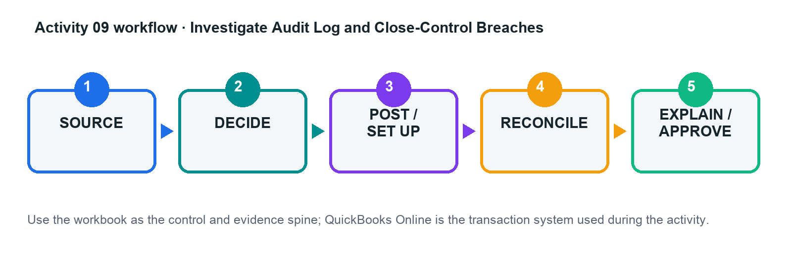

# Advanced Transactional Accounting with QuickBooks Online — Learner Guide

**WSQ Course Code:** TGS-2023018989  
**TSC:** Transactional Accounting · ACC-CRP-4009-1.1  
**Version:** 11.1 · 16 August 2026

> This guide contains the detailed procedures. The slide deck remains concept-led and visual.

## Learning Outcomes

- LO1: Perform advanced transactional accounting and double-entry accounting in a controlled QuickBooks Online workflow.
- LO2: Produce accurate financial statements, supporting schedules, and management reports from validated accounting data.
- LO3: Determine and communicate how reporting standards and accounting judgements affect financial information.

## Safe Practice Company and Evidence Rules

- Use the fictional activity data only.
- Never upload real customer, payroll, bank, tax, NRIC, or credentials.
- Feature names and availability can vary by QuickBooks Online subscription, region, and current interface.
- Preserve the source, decision, posting/configuration, report, reconciliation, exception, and approval trail.
- Tax and financial-reporting judgement must be escalated to an appropriately qualified reviewer.

## Topic 1 — Advanced Transactional Accounting

Control-ready masters · complex AR/AP · inventory · projects · bank feeds · month-end close

### Key concepts

- **Control before speed:** Automation scales both good coding and bad coding; design approval, evidence, and exception paths first.
- **Subledger discipline:** Customer, supplier, inventory, project, bank, and tax subledgers must reconcile to the general ledger.
- **Event-to-entry reasoning:** Identify the event, recognition point, accounts, debit/credit, tax treatment, and evidence before posting.
- **Period integrity:** Cut-off, accruals, prepayments, depreciation, FX, and reconciliations protect the reporting period.

### From basic bookkeeping to advanced control

*Prerequisite Bridge*

- Basic course boundary: navigation, simple invoices, bills, receipts, and standard reports are assumed.
- Advanced work adds estimates and judgements, linked documents, subledger controls, period-end entries, and evidence.
- A correct screen entry is not enough: it must post to the right period, account, tax code, project, and counterparty.
- Every workflow ends with a reconciliation or report-based acceptance test.

### Control-ready company file

*Master Data Architecture*

- Design a numbered chart of accounts with control accounts, clearing accounts, and reporting-friendly subaccounts.
- Separate trade receivables/payables, GST input/output, inventory asset/COGS, fixed assets/accumulated depreciation, and suspense.
- Govern customer, supplier, product/service, payment term, project, class/location, and custom-field masters.
- Prevent duplicates through naming conventions, ownership, change approval, and periodic inactive-master review.

### Event-to-entry decision model

*Double-Entry*

- Business event: what happened, with whom, for how much, and when did control/performance occur?
- Recognition: does the event create an asset, liability, income, expense, equity movement, or disclosure only?
- Posting: select source document, accounts, debit/credit, GST code, project/segment, date, and supporting evidence.
- Verification: inspect the audit trail, subledger, trial balance, and financial-statement effect.

### Advanced order-to-cash

*Accounts Receivable*

- Connect estimate, deposit/advance, invoice or progress invoice, receipt, credit memo, refund, and write-off.
- Keep customer advances as liabilities until the performance obligation is satisfied; do not force early revenue.
- Apply receipts to the correct open invoices and investigate unapplied cash and negative customer balances.
- Use ageing, overdue reminders, statements, credit limits, and collection notes as one controlled cycle.

### Returns, credits, refunds, and bad debts

*Exception Handling*

- Credit memo reduces the customer's balance; refund receipt records cash returned—choose based on the commercial event.
- Link the reversal to the original product/service and GST treatment to preserve revenue and tax reporting.
- A write-off requires evidence of recoverability review and the approved bad-debt account/tax treatment.
- Monitor unusual credits, backdated changes, duplicate refunds, and manual journals to receivables.

### Advanced procure-to-pay

*Accounts Payable*

- Connect purchase request/approval, purchase order, receipt, supplier bill, bill credit, payment, and supplier statement.
- A purchase order is a commitment, not yet an expense or liability; recognition follows receipt and the applicable policy.
- Use three-way thinking: order, receipt, and invoice should agree on item, quantity, price, tax, and project.
- Separate vendor creation, invoice approval, and payment release; investigate duplicate invoice numbers and bank changes.

### Recurring transactions with governance

*Automation*

- Scheduled templates post automatically; reminders require review; unscheduled templates standardise repeatable entries.
- Use recurring entries for predictable amounts only, or pair variable templates with an evidence-based review.
- Assign an owner, end date, review frequency, tax treatment, and exception rule to every template.
- Audit the recurring-template list before close and after contract, rate, or GST changes.

### Inventory and cost of sales

*Quantity And Value*

- Purchases increase inventory asset and quantity; sales reduce inventory and recognise cost of goods sold.
- Reconcile quantity-on-hand, inventory valuation, general-ledger balance, and physical count evidence.
- Investigate negative inventory, backdated purchases/sales, inactive items, unit-of-measure errors, and unusual adjustments.
- Adjustments need reason codes, approval, evidence, and an understood profit impact—not a plug to make reports agree.

### Projects, time, and billable costs

*Job Profitability*

- Assign revenue, supplier costs, expenses, time, and billable items to the correct customer project.
- Separate billable status from accounting classification: an expense can be valid but assigned to the wrong project.
- Compare estimate, invoiced, earned, cost incurred, unbilled time/expense, and margin to expose leakage.
- Close a project only after final billing, cost capture, write-off decisions, and profitability review.

### Bank feeds and rule design

*Automation With Review*

- A bank-feed line is external evidence, not automatically a new accounting transaction; match before add.
- Use bank text, description, amount, account, payee, transaction type, category, tax, and project conditions deliberately.
- Rule priority matters; broad rules can override precise rules and silently misclassify high volumes.
- Enable auto-add only for stable, low-risk patterns with a periodic exception and sampling review.

### Reconciliation as a control

*Bank And Credit Card*

- Reconciliation proves the ledger agrees to an independent statement at a point in time.
- Opening balance, statement ending balance, cleared items, outstanding items, and difference form the control equation.
- Investigate missing, duplicate, altered, stale, and future-dated items; never force a zero with an unexplained adjustment.
- Preserve the reconciliation report and review changes to previously reconciled transactions in the audit log.

### Month-end adjusting entries

*Cut-Off And Estimates*

- Accruals recognise incurred costs/revenue before invoice or cash; reverse when the source transaction arrives where appropriate.
- Prepayments defer expense and release it systematically over the benefit period.
- Depreciation allocates depreciable amount over useful life; accumulated depreciation preserves gross asset cost.
- Foreign-currency monetary items may require period-end remeasurement and documented exchange-rate evidence.

### Close, roles, and audit trail

*Books Integrity*

- Sequence the close: transaction cut-off, subledgers, reconciliations, adjustments, analytical review, approval, then lock.
- Apply least privilege and segregation of duties across master data, posting, reconciliation, reporting, and payment.
- The audit log supports who/what/when investigation; it does not explain business purpose without supporting documents.
- A close-date password and exception approval reduce unauthorised backdating after management sign-off.

## Topic 2 — Financial Reporting and Management Insight

Statement integrity · report design · ageing · profitability · GST · variance and decision narratives

### Key concepts

- **Reports are outputs:** A polished report cannot repair incomplete, duplicated, misdated, or misclassified transactions.
- **Triangulate:** Tie the Profit and Loss, Balance Sheet, Cash Flow, subledgers, and reconciliation evidence together.
- **Segment with purpose:** Projects, customers, products, classes, locations, and custom fields answer different management questions.
- **Explain the movement:** A management pack pairs numbers with drivers, risks, actions, owners, and due dates.

### Financial statement architecture

*Reporting Framework*

- Profit and Loss explains performance over a period; Balance Sheet shows financial position at a date.
- Cash Flow explains movements in cash; profit can rise while cash falls because timing and non-cash items differ.
- Retained earnings links current and prior-period results to equity, subject to distributions and adjustments.
- Report basis, period, comparison, currency, grouping, and accounting method must be explicit.

### Subledger-to-ledger reporting bridge

*Report Integrity*

- AR ageing should tie to accounts receivable; AP ageing should tie to accounts payable.
- Inventory valuation should tie to inventory asset; bank reconciliations should support cash balances.
- GST detail and control accounts should support the return working paper.
- A trial balance is mathematically balanced even when classification, timing, or completeness is wrong.

### Report dimensions and traceability

*Segmentation*

- Use customers/projects for counterparty and job profitability; products/services for revenue and margin mix.
- Use classes or locations for responsibility/operating segments where the subscription supports them.
- Use custom fields for controlled transaction attributes; avoid free-text labels that cannot be governed.
- Document feature availability: reports and tracking options vary by QuickBooks Online subscription and region.

### Custom report design

*Question-Led Reporting*

- Start with the decision question, user, period, grain, measure, comparison, filter, and required evidence.
- Choose a base report that contains the necessary transactions and dimensions before customising.
- Save consistent filters and naming; schedule only after ownership, confidentiality, and recipient accuracy are confirmed.
- Exported Excel/PDF copies are snapshots—label period, basis, run date, and source company.

### Receivables and payables analysis

*Working Capital*

- Ageing is a risk view, not just a collection list; separate current, overdue, disputed, credit, and unapplied balances.
- Track days sales outstanding, overdue concentration, promise-to-pay status, and collection outcomes.
- For payables, combine ageing with due dates, cash forecast, supplier criticality, discounts, and disputed items.
- Reconcile ageing totals before presenting working-capital conclusions.

### Profitability and variance

*Management Insight*

- Bridge revenue, volume/mix, direct cost, gross margin, overhead, and net result across periods or plans.
- Project and product margin analysis must capture all attributable costs and avoid unassigned expenses.
- Distinguish one-off, timing, structural, volume, price, mix, and efficiency drivers.
- Pair every material variance with evidence, an owner, a corrective action, and a target date.

### Cash flow and liquidity

*Profit Is Not Cash*

- Operating cash is affected by profit, receivables, payables, inventory, tax, and other working-capital movements.
- Investing activity captures long-lived asset movements; financing captures debt, capital, and distributions.
- Use bank reconciliations and balance-sheet movements to challenge the cash-flow narrative.
- A positive profit with ageing receivables and rising inventory can still create a liquidity squeeze.

### GST control and return readiness

*Singapore Gst*

- Singapore's prevailing GST rate is 9%; validate transaction date, place/treatment, tax code, and documentary support.
- Separate standard-rated, zero-rated, exempt, out-of-scope, reverse-charge, and disallowed input-tax cases as applicable.
- Tie taxable supplies/purchases and output/input tax from transaction detail to control accounts and the GST working paper.
- Corrections may require GST F7; retain evidence and escalate tax judgement rather than forcing a QuickBooks code.

### Management report pack

*From Data To Action*

- Executive summary: what changed, why it matters, and the decision required.
- Core statements: Profit and Loss, Balance Sheet, Cash Flow, with comparisons and consistent basis.
- Schedules: AR/AP ageing, inventory, project profitability, GST, reconciliation, and exception log.
- Actions: issue, evidence, impact, owner, due date, and status; preserve drill-down traceability.

### Analytical review and red flags

*Quality Before Presentation*

- Scan for unexpected signs, round-number journals, dormant accounts, suspense balances, and backdated entries.
- Compare margin, working capital, ageing, inventory days, and tax ratios over time and against operational context.
- Investigate rather than delete anomalies; document conclusion and evidence even when no correction is required.
- Management commentary must separate verified facts, estimates, assumptions, and recommended actions.

## Topic 3 — Accounting Principles and Standards

Singapore reporting framework · recognition and measurement · estimates · disclosures · system-to-standard bridge

### Key concepts

- **Singapore context:** Use the applicable SFRS(I), FRS, or SFRS for Small Entities framework—not a generic US-GAAP shortcut.
- **System is not policy:** QuickBooks records approved accounting treatments; it does not choose the reporting framework or judgement.
- **Recognition and measurement:** Timing, classification, estimates, and measurement bases shape profit, assets, liabilities, and disclosures.
- **Qualitative characteristics:** Relevance, faithful representation, comparability, verifiability, timeliness, and understandability guide choices.

### Applicable reporting framework

*Singapore Standards*

- Determine whether the entity applies SFRS(I), FRS, SFRS for Small Entities, or another permitted framework.
- Document policy choices, effective dates, transition requirements, materiality, and disclosure obligations.
- Use current ASC/ACRA/IRAS and professional advice where judgement or regulation is consequential.
- QuickBooks account names and reports do not establish compliance by themselves.

### Accrual and matching

*Recognition Timing*

- Recognise income and expenses when the underlying rights, obligations, and performance occur—not merely when cash moves.
- Customer deposits may be contract liabilities; unbilled earned revenue may require receivable/contract-asset analysis.
- Supplier invoices received late do not erase obligations existing at reporting date.
- Use reversal and clearing logic to avoid double counting when source documents arrive after close.

### Revenue recognition

*Performance Obligations*

- Identify the contract, performance obligations, transaction price, allocation, and satisfaction pattern.
- Invoice date, payment date, and revenue-recognition date can differ.
- Project deposits, progress billing, credits, refunds, and variable consideration require consistent policy mapping.
- QuickBooks forms operationalise the approved policy; they do not replace contract analysis.

### Inventory measurement

*Cost And Nrv*

- Inventory includes eligible purchase and conversion costs under the applicable policy, not every related expenditure.
- Compare carrying amount with net realisable value and recognise write-downs where required.
- Obsolescence, damage, slow movement, negative quantities, and post-period sales inform the estimate.
- A quantity adjustment changes both operational records and financial results; evidence and approval are essential.

### Property, plant and equipment

*Capitalise, Depreciate, Impair*

- Capitalise when recognition criteria are met; expense repairs and routine maintenance under the policy.
- Component, useful life, residual value, method, and start date drive depreciation.
- Review indicators of impairment and changes in estimates; apply prospectively where required.
- Maintain a fixed-asset register outside or alongside QuickBooks and reconcile it to cost and accumulated depreciation accounts.

### Foreign currency

*Transaction And Closing-Rate Effects*

- Record foreign-currency transactions using the applicable transaction-date rate and preserve source evidence.
- Remeasure monetary balances at reporting date where required; recognise exchange differences appropriately.
- Distinguish transaction currency, functional currency, and presentation currency.
- Subscription features and exchange-rate automation do not remove the need for policy, reasonableness, and close review.

### Estimates, errors, and policy changes

*Change Classification*

- A change in estimate reflects new information; a prior-period error corrects information that was available or could reasonably have been obtained.
- A policy change follows the applicable standard and transition rules; do not label every correction an estimate.
- Assess materiality individually and in aggregate, including qualitative effects on users and covenants.
- Preserve an adjustment paper: issue, requirement, calculation, entries, statements affected, disclosure, approval, and evidence.

### Qualitative characteristics

*A4 Decision Lens*

- Relevance: information can influence decisions; materiality is entity-specific.
- Faithful representation: complete, neutral, and free from material error—not merely precise-looking.
- Comparability and consistency help users understand change; consistency is not a reason to preserve a wrong policy.
- Verifiability, timeliness, and understandability constrain how treatments, evidence, and explanations are designed.

### System-to-standard bridge

*Impact Assessment*

- Translate a new or changed requirement into affected transactions, masters, estimates, reports, controls, and disclosures.
- Determine opening/transition adjustments, effective date, comparative treatment, and audit evidence.
- Configure accounts, products/services, recurring entries, custom fields, reports, and close checklists only after policy approval.
- Test the full chain in a sample company before production and document residual manual controls.

## Detailed Activities

### Activity 01 — Design a Control-Ready Company File

**Level:** Foundation bridge  
**Criteria:** K1, A1  

**Scenario**

Orchid Office Solutions Pte Ltd is moving from basic bookkeeping to a controlled cloud ledger before expanding into project work and inventory.

**Goal**

Map opening balances and master data into a numbered chart of accounts with control, clearing, GST, inventory, fixed-asset, and suspense accounts.

**Workflow**

**Files**

- `chart_of_accounts.csv`
- `customers.csv`
- `suppliers.csv`
- `products_services.csv`

**Detailed step-by-step**

1. Open the activity control workbook and read the Scenario, Data Dictionary, and Acceptance Tests sheets.

2. Review the legacy account list and classify each row as retain, rename, merge, make inactive, or create new.

3. Map control accounts for accounts receivable, accounts payable, inventory asset, GST input/output, fixed assets, accumulated depreciation, and suspense.

4. Review customer, supplier, and product/service CSVs for duplicate names, missing tax treatment, inactive records, and inconsistent terms.

5. In a QuickBooks Online practice company, create or import only the approved masters; keep a screenshot or exported list as evidence.

6. Post or verify opening balances using the approved effective date and record every unresolved item in the exception log.

7. Run a trial balance and master-data review; confirm the acceptance tests and obtain peer/trainer approval before proceeding.

**Acceptance criteria**

- [ ] Trial balance debits equal credits
- [ ] All control accounts have an owner and purpose
- [ ] No duplicate active masters
- [ ] Every exception has an owner and due date

### Activity 02 — Run an Advanced Order-to-Cash Cycle

**Level:** Intermediate  
**Criteria:** K1, A1  

**Scenario**

Merlion Fit-Outs receives a customer deposit, bills a project in stages, handles a scope reduction, and refunds an overpayment.

**Goal**

Process estimate-to-cash events without recognising revenue early or leaving unapplied customer balances.

**Workflow**

**Files**

- `customers.csv`
- `products_services.csv`
- `sales_events.csv`

**Detailed step-by-step**

1. Read the contract milestones and identify performance, billing, and cash dates for every event.

2. Complete the event-to-entry matrix, including GST code, project, debit, credit, and supporting document.

3. Create the customer, project, products/services, estimate, and customer-deposit treatment in the practice company.

4. Create the milestone invoices only when the scenario's billing conditions are met; link the receipt to the correct open item.

5. Process the scope reduction with a credit memo and the overpayment with the appropriate refund workflow.

6. Run customer balance detail, AR ageing, Profit and Loss, and Balance Sheet reports for the activity period.

7. Reconcile invoice, receipt, credit, refund, revenue, GST, receivable, and customer-advance amounts; resolve all differences.

**Acceptance criteria**

- [ ] No unexplained unapplied cash or negative customer balance
- [ ] Revenue follows the scenario recognition point
- [ ] AR ageing agrees to the control account
- [ ] Credit/refund trace to original GST treatment

### Activity 03 — Control Procure-to-Pay and Supplier Exceptions

**Level:** Intermediate  
**Criteria:** K1, A1  

**Scenario**

Harbour Tech Services buys equipment and subcontractor services, receives a price variance, a partial delivery, and a supplier credit.

**Goal**

Apply order-receipt-invoice thinking, prevent duplicate liabilities, and preserve approval evidence.

**Workflow**

**Files**

- `suppliers.csv`
- `purchase_events.csv`
- `supplier_statement.csv`

**Detailed step-by-step**

1. Review supplier master changes and flag any duplicate, incomplete, or bank-account-change records for independent approval.

2. Map each purchase event to commitment, receipt, liability, expense/asset, GST, and payment stages.

3. Create the purchase order and record only the quantity actually received when preparing the supplier bill.

4. Record the supplier credit against the correct item/account and GST treatment; avoid netting it against unrelated bills.

5. Prepare payment for approved, due items and record the approval reference in the evidence register.

6. Run AP ageing and supplier balance detail, then reconcile them to the supplier statement and AP control account.

7. Document open items, disputed variances, and corrective actions with owners and dates.

**Acceptance criteria**

- [ ] No duplicate invoice posted
- [ ] AP ageing agrees to control account
- [ ] Partial receipt and price variance are explained
- [ ] Supplier credit is correctly applied

### Activity 04 — Reconcile Inventory Quantity and Value

**Level:** Intermediate  
**Criteria:** K1, A1  

**Scenario**

Lion City Components has sales before purchase entry, damaged stock, a count variance, and an obsolete item.

**Goal**

Correct quantity and value while explaining the cost-of-sales and profit impact of every adjustment.

**Workflow**

**Files**

- `inventory_items.csv`
- `inventory_movements.csv`
- `physical_count.csv`

**Detailed step-by-step**

1. Review item setup for SKU, inventory/non-inventory type, income account, inventory asset, COGS, cost, price, and GST.

2. Sequence purchases, sales, returns, and adjustments by transaction date; identify events that create negative inventory.

3. Enter or import the approved transactions in the practice company and retain the source-document reference.

4. Compare QuickBooks quantity-on-hand with the physical count; classify differences as timing, damage, error, or obsolescence.

5. Prepare and approve quantity/value adjustments using a specific reason and supporting evidence.

6. Run inventory valuation summary/detail, stock-on-hand, Profit and Loss, and Balance Sheet reports.

7. Reconcile inventory valuation to the inventory asset account and explain the COGS/margin effect.

**Acceptance criteria**

- [ ] No unexplained negative inventory
- [ ] Valuation agrees to GL
- [ ] Adjustment reasons and approvals are complete
- [ ] COGS impact is explained

### Activity 05 — Measure Project Profitability and Billing Leakage

**Level:** Advanced  
**Criteria:** K1, A1  

**Scenario**

Marina Design Studio tracks fixed-fee design projects with staff time, subcontractors, reimbursable costs, and milestone billing.

**Goal**

Capture all project revenue and cost, identify unbilled work, and distinguish accounting accuracy from project performance.

**Workflow**

**Files**

- `projects.csv`
- `timesheets.csv`
- `project_costs.csv`

**Detailed step-by-step**

1. Review project contracts, estimates, billing milestones, staff cost rates, and billable-cost policy.

2. Create the customers/projects and verify project-tracking settings in the practice company.

3. Record time, supplier costs, expenses, estimates, and invoices against the correct project.

4. Identify transactions with missing or wrong project assignment and correct them with an audit note.

5. Run project profitability, unbilled time/expense, transaction detail, and customer balance reports.

6. Reconcile revenue and costs to the project control workbook and compute margin with formulas.

7. Write a management note on leakage, overruns, billing action, and evidence limitations.

**Acceptance criteria**

- [ ] All attributable activity is assigned
- [ ] Unbilled items are actioned
- [ ] Project report agrees to source schedules
- [ ] Margin conclusion identifies drivers and limits

### Activity 06 — Engineer Bank Rules and Feed Exceptions

**Level:** Advanced  
**Criteria:** K1, A1  

**Scenario**

Northstar Catering receives a month of bank-feed lines with ambiguous descriptions, transfers, card settlements, loan receipts, and recurring rent.

**Goal**

Match before add, design precise rule priority, and restrict auto-add to low-risk transactions.

**Workflow**

**Files**

- `bank_feed.csv`
- `existing_ledger.csv`
- `rule_candidates.csv`

**Detailed step-by-step**

1. Load the bank-feed, existing-ledger, and rule-candidate sheets; do not post anything until possible matches are identified.

2. Classify each line as match, transfer, add, exclude with reason, or investigate; document the evidence.

3. Design rules from most specific to most general using bank text/description, amount, account, payee, category, GST, and project.

4. Mark only stable, low-risk patterns as eligible for auto-add and define a review sample/frequency.

5. In the practice company, create the approved rules and process the test batch.

6. Compare predicted and actual classification; investigate false positives and false negatives.

7. Update the rule register with owner, priority, status, auto-add decision, and next review date.

**Acceptance criteria**

- [ ] Existing entries are matched, not duplicated
- [ ] Rule priority is documented
- [ ] No high-risk auto-add rule
- [ ] Every excluded line has evidence

### Activity 07 — Resolve a Bank and Credit-Card Reconciliation

**Level:** Advanced  
**Criteria:** K1, A1  

**Scenario**

Sunrise Retail's books include a duplicate expense, an outstanding cheque, a missing fee, a deposit in transit, and a changed reconciled item.

**Goal**

Reach a supported zero difference without an unexplained forced adjustment.

**Workflow**

**Files**

- `bank_statement.csv`
- `credit_card_statement.csv`
- `ledger_transactions.csv`

**Detailed step-by-step**

1. Confirm the statement period, opening balance, ending balance, and complete ledger population.

2. Match statement lines to ledger entries by amount, date, reference, and commercial substance.

3. Classify differences as outstanding, in transit, missing, duplicate, altered, bank-only, or timing.

4. Prepare approved corrections for the duplicate and missing fee; do not clear outstanding/in-transit items prematurely.

5. Complete the QuickBooks reconciliation for bank and card accounts and save the reconciliation reports.

6. Review history/audit log for the changed previously reconciled item and document the resolution.

7. Roll forward outstanding items and obtain reviewer sign-off on the reconciliation workpaper.

**Acceptance criteria**

- [ ] Reconciliation difference is zero
- [ ] No forced unexplained adjustment
- [ ] Outstanding items roll forward
- [ ] Changes to reconciled items are investigated

### Activity 08 — Post and Reverse Month-End Adjustments

**Level:** Advanced  
**Criteria:** K1, A1  

**Scenario**

CloudWorks Asia closes June with unbilled utilities, prepaid insurance, equipment depreciation, deferred customer revenue, and a USD payable.

**Goal**

Prepare supported accrual, deferral, depreciation, and foreign-currency adjustments with reversal logic.

**Workflow**

**Files**

- `adjustment_inputs.csv`
- `exchange_rates.csv`
- `fixed_asset_register.csv`

**Detailed step-by-step**

1. Review each issue against the event, reporting period, policy, evidence, and materiality threshold.

2. Calculate accrual, prepaid release, depreciation, deferred-revenue release, and FX remeasurement using workbook formulas.

3. Prepare journal entries with date, debit, credit, tax treatment, class/project where relevant, memo, and attachment reference.

4. Identify which entries should reverse and set the approved reversal date/method.

5. Post the approved entries in the practice company; retain journal and audit-log evidence.

6. Run pre/post trial balance, Profit and Loss, and Balance Sheet reports and complete the bridge.

7. Review next-period reversal and source-document arrival to prevent double counting.

**Acceptance criteria**

- [ ] Entries balance
- [ ] Calculations are formula-driven and supported
- [ ] Reversals prevent double counting
- [ ] Statement effects match policy

### Activity 09 — Investigate Audit Log and Close-Control Breaches

**Level:** Advanced  
**Criteria:** K1, A1  

**Scenario**

After management sign-off, the controller finds a backdated invoice edit, a deleted bill, a new bank rule, and a supplier bank-detail change.

**Goal**

Reconstruct events, assess financial impact, strengthen roles, and lock the approved period.

**Workflow**

**Files**

- `audit_log.csv`
- `user_roles.csv`
- `close_checklist.csv`

**Detailed step-by-step**

1. Filter the audit-log dataset by date, user, event type, transaction, and indirect/system administration activity.

2. Reconstruct each event using before/after values and supporting-document references.

3. Quantify the financial-statement, tax, reconciliation, and control impact of every change.

4. Compare current roles with least privilege and segregation-of-duties requirements; propose changes.

5. Correct or escalate affected transactions in the practice company and document approval.

6. Complete the close checklist, set the approved close date/password control, and define exception authority.

7. Present root cause, immediate containment, corrective action, owner, and due date.

**Acceptance criteria**

- [ ] Every event is reconstructed
- [ ] Financial impact is quantified
- [ ] Role conflicts are remediated
- [ ] Close is locked with controlled exceptions

### Activity 10 — Build a Reconciled Financial Reporting Pack

**Level:** Advanced  
**Criteria:** K2, A2, A3  

**Scenario**

Beacon Services needs a monthly pack for directors after rapid growth created ageing, project-margin, and cash-flow concerns.

**Goal**

Produce statements and schedules that tie to validated source data, then explain performance drivers and actions.

**Workflow**

**Files**

- `trial_balance.csv`
- `profit_loss.csv`
- `balance_sheet.csv`
- `cash_flow.csv`
- `ar_ageing.csv`
- `ap_ageing.csv`
- `project_profitability.csv`

**Detailed step-by-step**

1. Confirm company, period, accounting method, currency, comparison basis, and report cut-off.

2. Import or copy the provided reports into the control workbook without overwriting the raw-data sheets.

3. Reconcile AR/AP ageing, cash, project results, retained earnings, and statement totals using formulas and exception flags.

4. Build trend and variance analyses for revenue, gross margin, operating result, working capital, and cash.

5. Investigate the largest movements by drilling to customers, suppliers, projects, products/services, and transactions.

6. Write an executive narrative separating facts, assumptions, risks, and recommendations.

7. Run the acceptance tests and export/share the final pack with period, basis, run date, and source clearly labelled.

**Acceptance criteria**

- [ ] All schedules tie to the GL or explain differences
- [ ] Statements are internally consistent
- [ ] Conclusions cite quantified drivers
- [ ] Actions have owner and date

### Activity 11 — Prepare a GST Control and F5 Working Paper

**Level:** Advanced  
**Criteria:** K2, A2, A3  

**Scenario**

Straits Commerce has standard-rated, zero-rated, exempt, out-of-scope, credit-note, and potentially disallowed input-tax transactions for a quarterly GST review.

**Goal**

Validate tax coding, reconcile output/input tax, and identify items requiring correction or escalation.

**Workflow**

**Files**

- `gst_transactions.csv`
- `gst_control_accounts.csv`
- `tax_code_matrix.csv`

**Detailed step-by-step**

1. Read the tax-code matrix and confirm the applicable period and prevailing rate; flag judgement cases for escalation.

2. Review each transaction's date, supply/purchase type, customer/supplier location, tax invoice evidence, tax code, and GST amount.

3. Recalculate expected GST using formulas and record coding/documentation exceptions without altering raw data.

4. Run or review GST detail reports and reconcile taxable values and output/input tax to the control accounts.

5. Populate the draft F5 working paper from validated totals and preserve the drill-down to source transactions.

6. Assess whether errors can be corrected in a subsequent F5 under the administrative concession or require GST F7/escalation.

7. Complete reviewer sign-off and retain evidence supporting claims and adjustments.

**Acceptance criteria**

- [ ] Output/input tax ties to control accounts
- [ ] Rate and coding exceptions are documented
- [ ] Disallowed/unsupported input tax is excluded or escalated
- [ ] Working paper traces to source

### Activity 12 — Capstone: Translate a Reporting Change into Books and Reports

**Level:** Capstone  
**Criteria:** K3, A2, A3, A4  

**Scenario**

Evergreen Events moves from cash-basis habits to an accrual reporting framework while introducing deposits, contract milestones, inventory, equipment, and foreign suppliers.

**Goal**

Assess policy impacts, post a controlled close, produce corrected statements, and present the qualitative-characteristic effects to management.

**Workflow**

**Files**

- `capstone_events.csv`
- `capstone_trial_balance.csv`
- `policy_change_log.csv`

**Detailed step-by-step**

1. Identify the applicable reporting framework and document assumptions, effective date, materiality, and areas requiring professional judgement.

2. Analyse customer deposits, unbilled revenue, supplier accruals, prepayments, inventory/NRV, PPE/depreciation, and foreign-currency balances.

3. Complete the impact matrix: requirement, current treatment, required treatment, entry, reports, disclosures, controls, and evidence.

4. Calculate and prepare approved adjustments in the capstone workbook; post them in the practice company where feasible.

5. Produce corrected Profit and Loss, Balance Sheet, Cash Flow, subledger/control schedules, and a pre/post bridge.

6. Evaluate relevance, faithful representation, comparability, verifiability, timeliness, and understandability before and after the change.

7. Present management conclusions, risks, limitations, actions, owners, dates, and residual manual controls.

**Acceptance criteria**

- [ ] All K3/A4 impacts are addressed
- [ ] Entries and statements reconcile
- [ ] Qualitative-characteristic analysis is specific
- [ ] Management actions and controls are implementable

## Assessment Preparation

- WA: 3 open-ended SAQs, 1 hour, covering K1–K3.
- PP: 3 practical tasks, 1 hour, covering A1–A4 and aligned to the activities.
- Open book: course slides, this guide, activity materials, and approved sources only.
- Submit on the LMS and complete the required assessment digital attendance and sign-off.

## Source Register

- **Course page:** 2 days/16 hours; LO1-LO3; published topic and assessment scope. https://www.tertiarycourses.com.sg/wsq-advanced-transactional-accounting-with-quickbooks-online.html
- **Intuit - bank rules:** rule conditions, priority, review, auto-add. https://quickbooks.intuit.com/learn-support/en-sg/help-article/banking/set-bank-rules-categorise-online-banking-online/L0mjJl0nD_SG_en_SG
- **Intuit - reconciliation:** reconciliation purpose and prerequisites. https://quickbooks.intuit.com/learn-support/en-us/help-article/statement-reconciliation/reconcile-account-quickbooks-online/L3XzsllsK_US_en_US
- **Intuit - projects:** project setup and profitability tracking. https://quickbooks.intuit.com/learn-support/en-sg/help-article/regular-payroll/track-income-costs-profitability-project/L6VLEZrgH_SG_en_SG
- **Intuit - audit log:** audit-log scope and indirect/system events. https://quickbooks.intuit.com/learn-support/en-us/help-article/audit-log/use-audit-log-quickbooks-online/L2WoVnW6I_US_en_US
- **Intuit - close books:** close and lock controls. https://quickbooks.intuit.com/learn-support/en-us/help-article/close-books/close-books-quickbooks-online/L59LelyPM_US_en_US
- **IRAS - completing GST returns:** 9% standard rate, return controls, common errors. https://www.iras.gov.sg/taxes/goods-services-tax-%28gst%29/filing-gst/completing-gst-returns
- **IRAS - correcting GST errors:** F7 and correction evidence. https://www.iras.gov.sg/taxes/goods-services-tax-%28gst%29/filing-gst/correcting-errors-made-in-gst-return-%28filing-gst-f7%29
