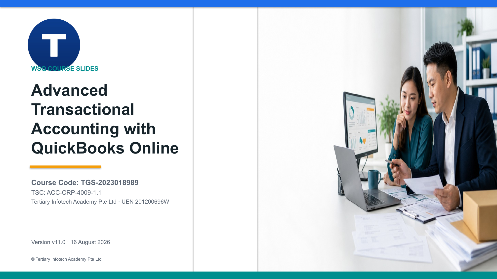

# Advanced Transactional Accounting with QuickBooks Online

**Course code:** TGS-2023018989  
**TSC:** Transactional Accounting · ACC-CRP-4009-1.1  
**Duration:** 2 days · 16 hours · 2-hour WA + PP assessment  
**Version:** v11.0 · 16 August 2026

This repository contains the learner-facing courseware and 12 self-contained advanced QuickBooks Online activities. Detailed procedures are in the Learner Guide and activity folders; the 139-slide deck is visual and concept-led.

## Package

- `courseware/` — trainer PPTX/PDF, Learner Guide DOCX/PDF, Lesson Plan DOCX/PDF, and slide map
- `activities/` — one folder per activity with guide, workflow visual, mock CSV data, and formula-driven Excel control workbook
- `LG-Advanced Transactional Accounting with QuickBooks Online.md` — Markdown mirror of the Learner Guide

## Learning arc

1. Advanced transactional accounting: controlled AR/AP, inventory, projects, bank feeds, reconciliation, month-end adjustments, close, roles, and audit log.
2. Financial reporting: reconciled statements, ageing, profitability, variance, cash flow, GST, and management reporting.
3. Accounting principles and standards: Singapore framework, accrual, revenue, inventory, PPE, FX, estimates, and qualitative characteristics.

## Important boundary

Assessment papers, answer keys, `.env`, references, build tooling, and QA renders are private and excluded from the public repository.

Course page: https://www.tertiarycourses.com.sg/wsq-advanced-transactional-accounting-with-quickbooks-online.html
