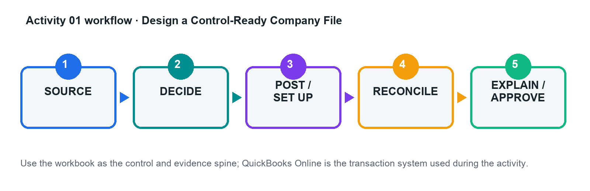

# Activity 01 — Design a Control-Ready Company File

**Level:** Foundation bridge  
**TSC mapping:** K1, A1  
**Estimated time:** 45–70 minutes  

## Scenario

Orchid Office Solutions Pte Ltd is moving from basic bookkeeping to a controlled cloud ledger before expanding into project work and inventory.

## Goal

Map opening balances and master data into a numbered chart of accounts with control, clearing, GST, inventory, fixed-asset, and suspense accounts.

## Workflow

## Files in this activity

- `activity-01-control.xlsx`
- `chart_of_accounts.csv`
- `customers.csv`
- `products_services.csv`
- `suppliers.csv`
- `workflow.png`

## Detailed step-by-step

1. Open the activity control workbook and read the Scenario, Data Dictionary, and Acceptance Tests sheets.

2. Review the legacy account list and classify each row as retain, rename, merge, make inactive, or create new.

3. Map control accounts for accounts receivable, accounts payable, inventory asset, GST input/output, fixed assets, accumulated depreciation, and suspense.

4. Review customer, supplier, and product/service CSVs for duplicate names, missing tax treatment, inactive records, and inconsistent terms.

5. In a QuickBooks Online practice company, create or import only the approved masters; keep a screenshot or exported list as evidence.

6. Post or verify opening balances using the approved effective date and record every unresolved item in the exception log.

7. Run a trial balance and master-data review; confirm the acceptance tests and obtain peer/trainer approval before proceeding.

## Evidence to retain

- Completed control workbook with formulas intact.
- QuickBooks Online report/export or screenshot references listed in the Evidence Log.
- Exception decisions and approval evidence.
- Final reconciliation and acceptance-test sign-off.

## Acceptance criteria

- [ ] Trial balance debits equal credits
- [ ] All control accounts have an owner and purpose
- [ ] No duplicate active masters
- [ ] Every exception has an owner and due date

## Trainer checkpoint

Explain one posting or configuration choice, its financial-statement effect, the control evidence, and what would happen if it were wrong.
