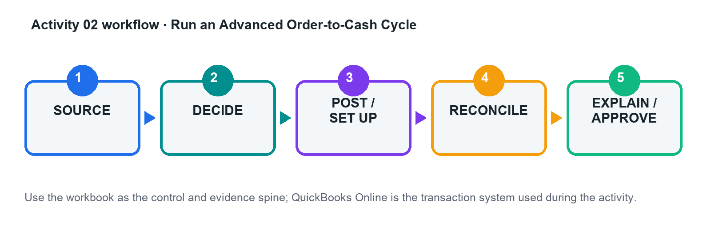

# Activity 02 — Run an Advanced Order-to-Cash Cycle

**Level:** Intermediate  
**TSC mapping:** K1, A1  
**Estimated time:** 45–70 minutes  

## Scenario

Merlion Fit-Outs receives a customer deposit, bills a project in stages, handles a scope reduction, and refunds an overpayment.

## Goal

Process estimate-to-cash events without recognising revenue early or leaving unapplied customer balances.

## Workflow

## Files in this activity

- `activity-02-control.xlsx`
- `customers.csv`
- `products_services.csv`
- `sales_events.csv`
- `workflow.png`

## Detailed step-by-step

1. Read the contract milestones and identify performance, billing, and cash dates for every event.

2. Complete the event-to-entry matrix, including GST code, project, debit, credit, and supporting document.

3. Create the customer, project, products/services, estimate, and customer-deposit treatment in the practice company.

4. Create the milestone invoices only when the scenario's billing conditions are met; link the receipt to the correct open item.

5. Process the scope reduction with a credit memo and the overpayment with the appropriate refund workflow.

6. Run customer balance detail, AR ageing, Profit and Loss, and Balance Sheet reports for the activity period.

7. Reconcile invoice, receipt, credit, refund, revenue, GST, receivable, and customer-advance amounts; resolve all differences.

## Evidence to retain

- Completed control workbook with formulas intact.
- QuickBooks Online report/export or screenshot references listed in the Evidence Log.
- Exception decisions and approval evidence.
- Final reconciliation and acceptance-test sign-off.

## Acceptance criteria

- [ ] No unexplained unapplied cash or negative customer balance
- [ ] Revenue follows the scenario recognition point
- [ ] AR ageing agrees to the control account
- [ ] Credit/refund trace to original GST treatment

## Trainer checkpoint

Explain one posting or configuration choice, its financial-statement effect, the control evidence, and what would happen if it were wrong.
