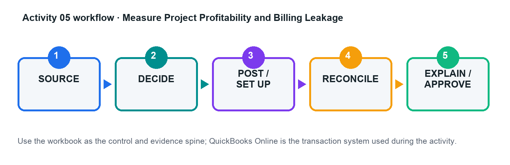

# Activity 05 — Measure Project Profitability and Billing Leakage

**Level:** Advanced  
**TSC mapping:** K1, A1  
**Estimated time:** 45–70 minutes  

## Scenario

Marina Design Studio tracks fixed-fee design projects with staff time, subcontractors, reimbursable costs, and milestone billing.

## Goal

Capture all project revenue and cost, identify unbilled work, and distinguish accounting accuracy from project performance.

## Workflow

## Files in this activity

- `activity-05-control.xlsx`
- `project_costs.csv`
- `projects.csv`
- `timesheets.csv`
- `workflow.png`

## Detailed step-by-step

1. Review project contracts, estimates, billing milestones, staff cost rates, and billable-cost policy.

2. Create the customers/projects and verify project-tracking settings in the practice company.

3. Record time, supplier costs, expenses, estimates, and invoices against the correct project.

4. Identify transactions with missing or wrong project assignment and correct them with an audit note.

5. Run project profitability, unbilled time/expense, transaction detail, and customer balance reports.

6. Reconcile revenue and costs to the project control workbook and compute margin with formulas.

7. Write a management note on leakage, overruns, billing action, and evidence limitations.

## Evidence to retain

- Completed control workbook with formulas intact.
- QuickBooks Online report/export or screenshot references listed in the Evidence Log.
- Exception decisions and approval evidence.
- Final reconciliation and acceptance-test sign-off.

## Acceptance criteria

- [ ] All attributable activity is assigned
- [ ] Unbilled items are actioned
- [ ] Project report agrees to source schedules
- [ ] Margin conclusion identifies drivers and limits

## Trainer checkpoint

Explain one posting or configuration choice, its financial-statement effect, the control evidence, and what would happen if it were wrong.
