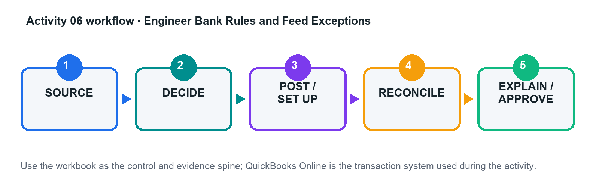

# Activity 06 — Engineer Bank Rules and Feed Exceptions

**Level:** Advanced  
**TSC mapping:** K1, A1  
**Estimated time:** 45–70 minutes  

## Scenario

Northstar Catering receives a month of bank-feed lines with ambiguous descriptions, transfers, card settlements, loan receipts, and recurring rent.

## Goal

Match before add, design precise rule priority, and restrict auto-add to low-risk transactions.

## Workflow

## Files in this activity

- `activity-06-control.xlsx`
- `bank_feed.csv`
- `existing_ledger.csv`
- `rule_candidates.csv`
- `workflow.png`

## Detailed step-by-step

1. Load the bank-feed, existing-ledger, and rule-candidate sheets; do not post anything until possible matches are identified.

2. Classify each line as match, transfer, add, exclude with reason, or investigate; document the evidence.

3. Design rules from most specific to most general using bank text/description, amount, account, payee, category, GST, and project.

4. Mark only stable, low-risk patterns as eligible for auto-add and define a review sample/frequency.

5. In the practice company, create the approved rules and process the test batch.

6. Compare predicted and actual classification; investigate false positives and false negatives.

7. Update the rule register with owner, priority, status, auto-add decision, and next review date.

## Evidence to retain

- Completed control workbook with formulas intact.
- QuickBooks Online report/export or screenshot references listed in the Evidence Log.
- Exception decisions and approval evidence.
- Final reconciliation and acceptance-test sign-off.

## Acceptance criteria

- [ ] Existing entries are matched, not duplicated
- [ ] Rule priority is documented
- [ ] No high-risk auto-add rule
- [ ] Every excluded line has evidence

## Trainer checkpoint

Explain one posting or configuration choice, its financial-statement effect, the control evidence, and what would happen if it were wrong.
