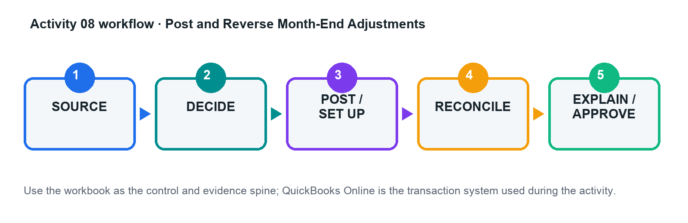

# Activity 08 — Post and Reverse Month-End Adjustments

**Level:** Advanced  
**TSC mapping:** K1, A1  
**Estimated time:** 45–70 minutes  

## Scenario

CloudWorks Asia closes June with unbilled utilities, prepaid insurance, equipment depreciation, deferred customer revenue, and a USD payable.

## Goal

Prepare supported accrual, deferral, depreciation, and foreign-currency adjustments with reversal logic.

## Workflow

## Files in this activity

- `activity-08-control.xlsx`
- `adjustment_inputs.csv`
- `exchange_rates.csv`
- `fixed_asset_register.csv`
- `workflow.png`

## Detailed step-by-step

1. Review each issue against the event, reporting period, policy, evidence, and materiality threshold.

2. Calculate accrual, prepaid release, depreciation, deferred-revenue release, and FX remeasurement using workbook formulas.

3. Prepare journal entries with date, debit, credit, tax treatment, class/project where relevant, memo, and attachment reference.

4. Identify which entries should reverse and set the approved reversal date/method.

5. Post the approved entries in the practice company; retain journal and audit-log evidence.

6. Run pre/post trial balance, Profit and Loss, and Balance Sheet reports and complete the bridge.

7. Review next-period reversal and source-document arrival to prevent double counting.

## Evidence to retain

- Completed control workbook with formulas intact.
- QuickBooks Online report/export or screenshot references listed in the Evidence Log.
- Exception decisions and approval evidence.
- Final reconciliation and acceptance-test sign-off.

## Acceptance criteria

- [ ] Entries balance
- [ ] Calculations are formula-driven and supported
- [ ] Reversals prevent double counting
- [ ] Statement effects match policy

## Trainer checkpoint

Explain one posting or configuration choice, its financial-statement effect, the control evidence, and what would happen if it were wrong.
