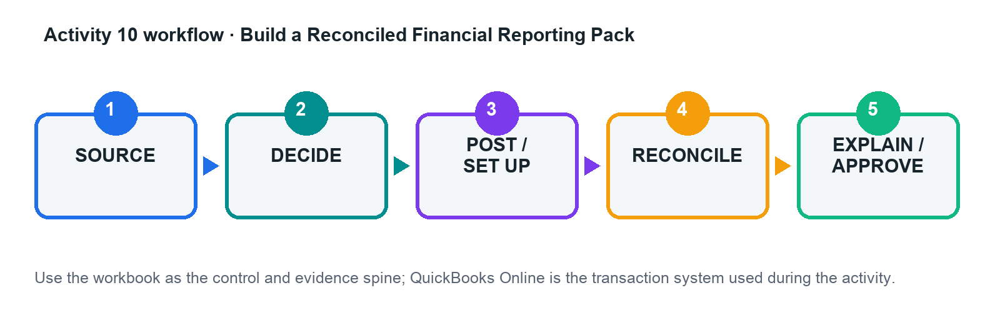

# Activity 10 — Build a Reconciled Financial Reporting Pack

**Level:** Advanced  
**TSC mapping:** K2, A2, A3  
**Estimated time:** 45–70 minutes  

## Scenario

Beacon Services needs a monthly pack for directors after rapid growth created ageing, project-margin, and cash-flow concerns.

## Goal

Produce statements and schedules that tie to validated source data, then explain performance drivers and actions.

## Workflow

## Files in this activity

- `activity-10-control.xlsx`
- `ap_ageing.csv`
- `ar_ageing.csv`
- `balance_sheet.csv`
- `cash_flow.csv`
- `profit_loss.csv`
- `project_profitability.csv`
- `trial_balance.csv`
- `workflow.png`

## Detailed step-by-step

1. Confirm company, period, accounting method, currency, comparison basis, and report cut-off.

2. Import or copy the provided reports into the control workbook without overwriting the raw-data sheets.

3. Reconcile AR/AP ageing, cash, project results, retained earnings, and statement totals using formulas and exception flags.

4. Build trend and variance analyses for revenue, gross margin, operating result, working capital, and cash.

5. Investigate the largest movements by drilling to customers, suppliers, projects, products/services, and transactions.

6. Write an executive narrative separating facts, assumptions, risks, and recommendations.

7. Run the acceptance tests and export/share the final pack with period, basis, run date, and source clearly labelled.

## Evidence to retain

- Completed control workbook with formulas intact.
- QuickBooks Online report/export or screenshot references listed in the Evidence Log.
- Exception decisions and approval evidence.
- Final reconciliation and acceptance-test sign-off.

## Acceptance criteria

- [ ] All schedules tie to the GL or explain differences
- [ ] Statements are internally consistent
- [ ] Conclusions cite quantified drivers
- [ ] Actions have owner and date

## Trainer checkpoint

Explain one posting or configuration choice, its financial-statement effect, the control evidence, and what would happen if it were wrong.
