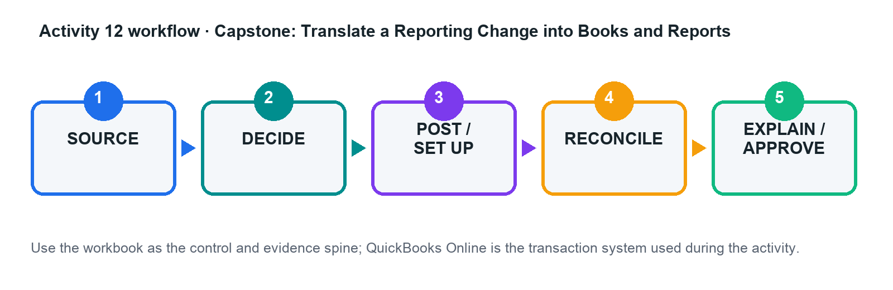

# Activity 12 — Capstone: Translate a Reporting Change into Books and Reports

**Level:** Capstone  
**TSC mapping:** K3, A2, A3, A4  
**Estimated time:** 45–70 minutes  

## Scenario

Evergreen Events moves from cash-basis habits to an accrual reporting framework while introducing deposits, contract milestones, inventory, equipment, and foreign suppliers.

## Goal

Assess policy impacts, post a controlled close, produce corrected statements, and present the qualitative-characteristic effects to management.

## Workflow

## Files in this activity

- `activity-12-control.xlsx`
- `capstone_events.csv`
- `capstone_trial_balance.csv`
- `policy_change_log.csv`
- `workflow.png`

## Detailed step-by-step

1. Identify the applicable reporting framework and document assumptions, effective date, materiality, and areas requiring professional judgement.

2. Analyse customer deposits, unbilled revenue, supplier accruals, prepayments, inventory/NRV, PPE/depreciation, and foreign-currency balances.

3. Complete the impact matrix: requirement, current treatment, required treatment, entry, reports, disclosures, controls, and evidence.

4. Calculate and prepare approved adjustments in the capstone workbook; post them in the practice company where feasible.

5. Produce corrected Profit and Loss, Balance Sheet, Cash Flow, subledger/control schedules, and a pre/post bridge.

6. Evaluate relevance, faithful representation, comparability, verifiability, timeliness, and understandability before and after the change.

7. Present management conclusions, risks, limitations, actions, owners, dates, and residual manual controls.

## Evidence to retain

- Completed control workbook with formulas intact.
- QuickBooks Online report/export or screenshot references listed in the Evidence Log.
- Exception decisions and approval evidence.
- Final reconciliation and acceptance-test sign-off.

## Acceptance criteria

- [ ] All K3/A4 impacts are addressed
- [ ] Entries and statements reconcile
- [ ] Qualitative-characteristic analysis is specific
- [ ] Management actions and controls are implementable

## Trainer checkpoint

Explain one posting or configuration choice, its financial-statement effect, the control evidence, and what would happen if it were wrong.
